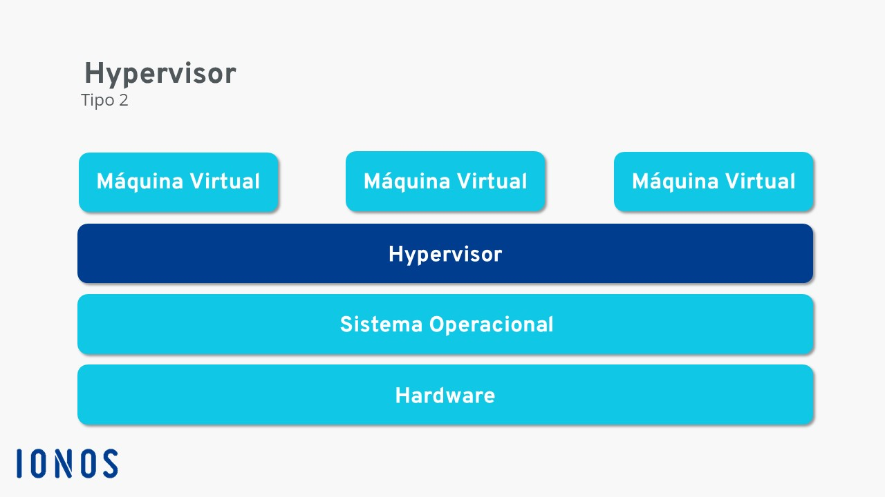
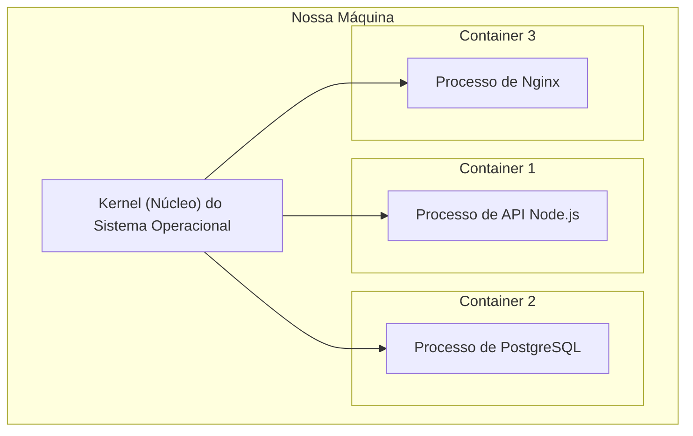
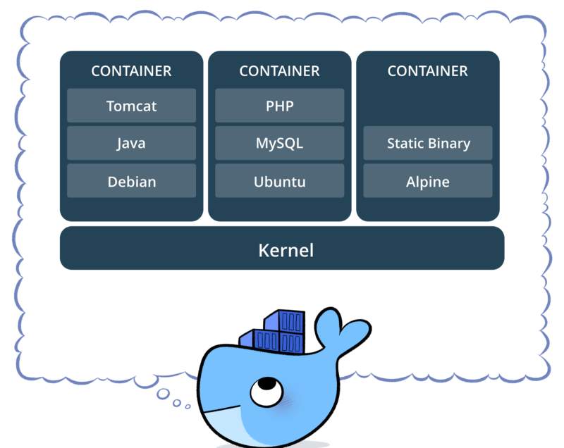

# Entendendo Containers do Docker

## O que são containers?

São locais onde você armazena o software, podendo transportá-lo para diferentes locais (computadores, notebooks, etc) mantendo consistência e tirando o maior problema de transportar sistemas, o famoso **"na minha máquina funciona"**.

---

## Diferença entre Conteinerização e Virtualização

### Virtual Machine - Virtualização

Em uma máquinas virtuais (VM), existe uma camada de isolamento chamada de **Hypervisor**, que **isola o Software de virtualização do nosso Sistema Operacional**, por exemplo, em uma máquina virtual, você aloca um Sistema Operacional independente e isolado do seu Sistema Operacional principal, o que permite que você possa mexer em diferentes SOs dentro de um único SO principal, e isso só é permitido graças ao Hypervisor.

#### Demonstração visual das camadas de uma VM

Como descrito na imagem:

Hardware => Sistema Operacional => **Hypervisor** => Máquinas virtuais 

O Hypervisor **separa** o seu **Sistema Operacional** das **Máquinas virtuais** existentes. 

### Docker - Conteinerização

Já no container, ele roda **diretamente encima do Sistema Operacional**. Isso é possível pois nos containers existem outro conceito de isolamento, os chamados **Namespaces**, que garantem diferentes níveis de isolamento.

Os **Namespaces** permitem por exemplo, que eu utilize partes do sistema principal, e também o **acesso ao kernel do nosso sistema operacional principal**.

Exemplo de Namespaces:

- PID (Process Identifier Namespace)
    - isolamento de processos que estão em execução dentro do container.
- NET (Network Namespace)
    - isolamento dos recursos de rede, como interfaces de rede, endereços IP e tabelas de roteamento. 

- IPC (Inter-Process Communication Namespace)
    - isolamento dos mecanismos de comunicação entre processos, como filas de mensagens e memória compartilhada. 

- MNT (Mount Namespace)
    - isolamento do sistema de arquivos e pontos de montagem, garantindo que alterações no sistema de arquivos dentro de um container não afetem o sistema de arquivos fora dele.

- UTS (Unix Timesharing System Namespace)
    - Isolamento do kernel, permitindo que o container atue como se o contêiner fosse outro host

Os contêineres são executados na nossa máquina como **processos isolados**, o que facilita na eficiência no uso de recursos, é possível fazer esse gerenciamento de recursos utilizando o conceito **Cgroups (Grupos de controles)**, que permite justamente esse gerenciamento de recursos de um contêiner.

#### Demonstração visual das camadas de um container

