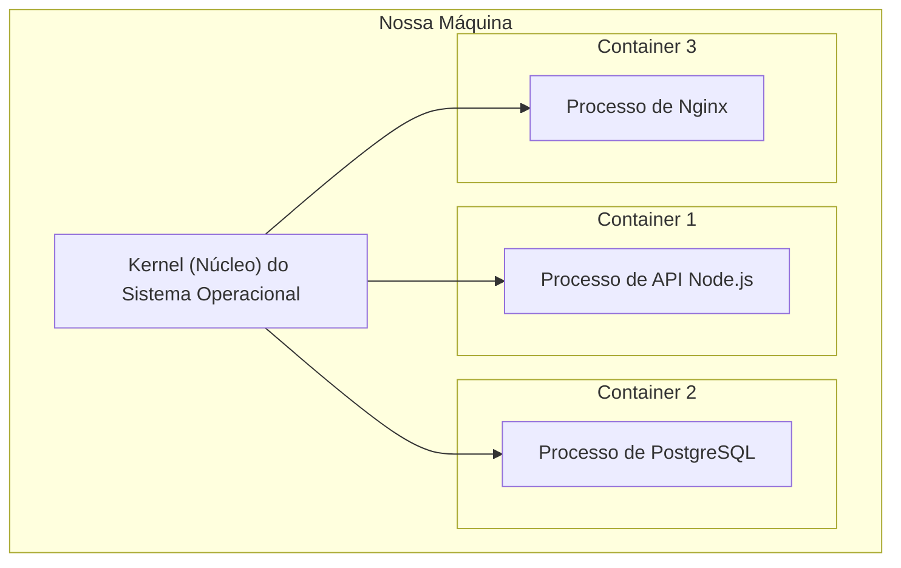

# Entendendo Containers do Docker

## O que são containers?

Containers são ambientes isolados que executam aplicações como processos no sistema operacional hospedeiro. Eles são criados a partir de **imagens**, que contêm o software e suas dependências.

---

## Diferença entre Conteinerização e Virtualização

### Virtual Machine - Virtualização

Em uma máquinas virtuais (VM), existe uma camada de isolamento chamada de **Hypervisor**, que **administra e isola as máquinas virtuais, distribuindo recursos para elas como CPU, memória, armazenamento e dispositivos**, por exemplo, em uma máquina virtual, você aloca um Sistema Operacional independente e isolado do seu Sistema Operacional principal, o que permite que você possa mexer em diferentes SOs dentro de um único SO principal, e isso só é permitido por conta do ao **Hypervisor**.

#### Demonstração visual das camadas de uma VM

Como descrito na imagem:

Hardware => Sistema Operacional => **Hypervisor Tipo 2** => Máquinas virtuais 

O Hypervisor Tipo 2 **isola** as máquinas virtuais entre si e controla o acesso delas aos recursos físicos da máquina hospedeira. 

### Docker - Conteinerização

Já no container, ele é executado **como um conjunto de processos isolados pelo container runtime** e compartilha o kernel do SO hospedeiro. Isso é possível pois nos containers existem outro conceito de isolamento, os chamados **Namespaces**, que garantem diferentes níveis de isolamento.

#### Demonstração visual das camadas de um container

Como na imagem:

Kernel Compartilhado => Container 01 | Container 02 | Container 03

Não existe um sistema operacional completo separado para cada container, mas existe uma camada de execução e gerenciamento formada pelo **Docker Engine** e pelo **Container Runtime**.

---

## Namespaces e Cgroups

Os containers compartilham o kernel do sistema operacional hospedeiro, enquanto os namespaces **isolam a visão que cada container possui de determinados recursos do sistema**.

Exemplo de Namespaces:

- PID (Process ID Namespace)
    - isolamento de processos que estão em execução dentro do container.

- NET (Network Namespace)
    - isolamento dos recursos de rede, como interfaces de rede, endereços IP e tabelas de roteamento. 

- IPC (Inter-Process Communication Namespace)
    - isolamento dos mecanismos de comunicação entre processos, como filas de mensagens e memória compartilhada. 

- MNT (Mount Namespace)
    - isola a visão dos pontos de montagem e da árvore de sistemas de arquivos de cada container.

- UTS (Unix Timesharing System Namespace)
    - isola o hostname e o nome de domínio NIS, permitindo que cada container possua uma identificação própria de host, mesmo compartilhando o mesmo kernel.

Os contêineres são executados na nossa máquina como **processos isolados**, o que facilita na eficiência no uso de recursos, é possível fazer esse gerenciamento de recursos utilizando o conceito **Cgroups (Grupos de controle)**, que permite justamente esse gerenciamento de recursos de um contêiner.

