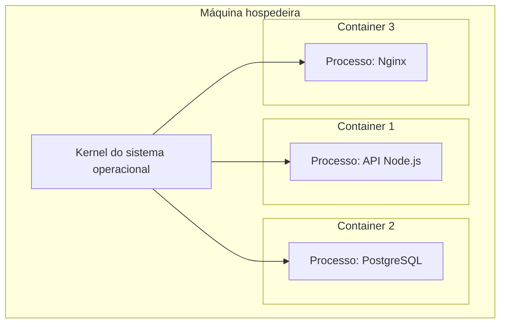

# Fundamentos de Containers

## Ideia principal

Containers são ambientes isolados que executam aplicações como processos no sistema operacional hospedeiro. Eles são criados a partir de imagens, que carregam o software, suas dependências e as configurações necessárias para rodar.


> Container não é uma máquina virtual completa. Ele parece um ambiente próprio, mas roda como processo isolado usando o kernel da máquina hospedeira.

## Virtualização vs conteinerização

| Ponto | Máquina virtual | Container |
| --- | --- | --- |
| Isolamento | Feito pelo hypervisor | Feito principalmente por namespaces e cgroups |
| Sistema operacional | Cada VM costuma ter um SO completo | Compartilha o kernel do host |
| Consumo de recursos | Maior | Menor |
| Inicialização | Mais pesada | Mais rápida |
| Uso comum | Rodar sistemas operacionais completos | Rodar aplicações e serviços isolados |

## Virtual Machine

Em uma máquina virtual existe uma camada de isolamento chamada hypervisor. Ela administra e isola as VMs, distribuindo recursos como CPU, memória, armazenamento e dispositivos.


Fluxo simplificado:

```text
Hardware -> Sistema Operacional -> Hypervisor Tipo 2 -> Máquinas virtuais
```

O hypervisor isola as máquinas virtuais entre si e controla o acesso delas aos recursos físicos da máquina hospedeira.

## Docker e conteinerização

No Docker, o container é executado como um conjunto de processos isolados pelo container runtime. Ele não carrega um sistema operacional completo separado, mas compartilha o kernel do sistema operacional hospedeiro.


Fluxo simplificado:

```text
Kernel compartilhado -> Container 1 | Container 2 | Container 3
```

Existe uma camada de execução e gerenciamento formada pelo Docker Engine e pelo container runtime.

## Namespaces

Namespaces isolam a visão que cada container tem de determinados recursos do sistema.

| Namespace | O que isola |
| --- | --- |
| PID | Processos em execução dentro do container |
| NET | Interfaces de rede, endereços IP e rotas |
| IPC | Comunicação entre processos, filas de mensagens e memória compartilhada |
| MNT | Pontos de montagem e árvore de arquivos |
| UTS | Hostname e identificação do sistema |

## Cgroups

Cgroups, ou grupos de controle, permitem limitar e gerenciar recursos usados por processos. Eles ajudam a controlar quanto um container pode consumir de CPU, memória e outros recursos.



## Por que containers ajudam no desenvolvimento

A ideia dos containers resolve um problema comum: a diferença entre ambientes de desenvolvimento, teste, homologação e produção.

Com Docker, o software viaja junto com suas dependências e configurações. Isso reduz erros do tipo "funciona na minha máquina", porque o ambiente fica descrito e reproduzível.

## Frases para memorizar

```text
VM = máquina completa virtualizada.
Container = processo isolado com ambiente próprio.
Imagem = base parada usada para criar containers.
```

```text
Um container compartilha o kernel do host, mas enxerga o sistema de forma isolada.
```
