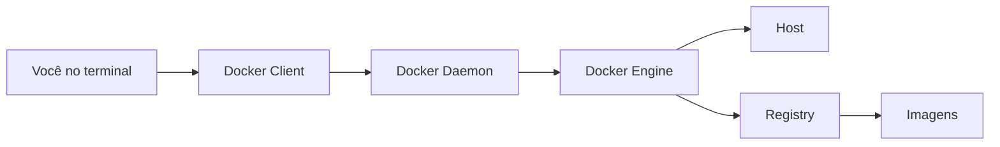
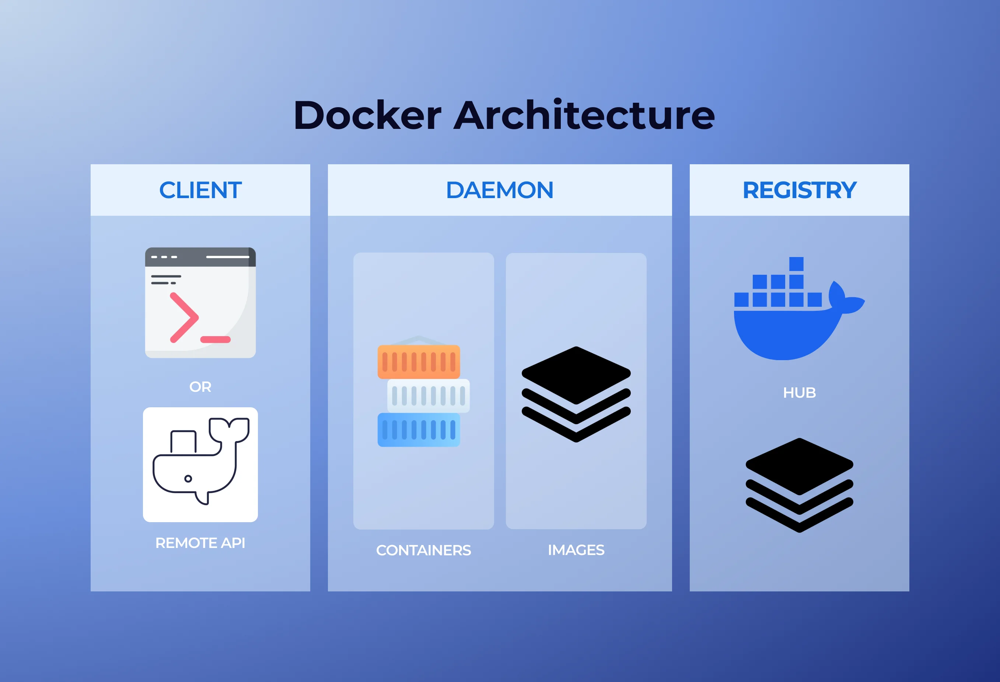

# Arquitetura do Docker

## Visão geral

Quando você digita um comando Docker no terminal, o Docker Client envia o pedido para o Docker Daemon. O Daemon executa a ação usando o Docker Engine, conversando com o host e, quando necessário, com um registry.





Essa imagem ajuda a visualizar o caminho completo: o comando sai do Docker Client, chega ao Docker Daemon no host e o Daemon decide se precisa criar container, usar uma imagem local, baixar uma imagem do registry ou gerenciar recursos como volumes e redes.

Leitura rápida da imagem:

```text
Client -> Daemon -> Host
Daemon -> Imagens, containers, volumes e redes
Daemon <-> Registry quando precisa baixar ou publicar imagens
```

## Host

A máquina hospedeira, ou host, é onde o Docker está rodando.

Pode ser:

- seu computador físico;
- uma máquina virtual;
- um servidor na nuvem;
- um ambiente Linux;
- uma VM Linux por trás do Docker Desktop;
- um ambiente WSL2 no Windows.

Vários containers podem rodar no mesmo host, isolados entre si:

```text
container 1 -> API
container 2 -> PostgreSQL
container 3 -> Redis
container 4 -> Nginx
```

## Docker Client

O Docker Client é a parte usada diretamente no terminal.

Exemplos:

```bash
docker run ubuntu
docker ps
docker images
docker stop meu-container
```

O client não executa tudo sozinho. Ele envia comandos para o Docker Daemon.

## Docker Daemon

O Docker Daemon é o processo que fica rodando em segundo plano. Ele recebe os comandos do Docker Client e executa as ações.

Exemplo:

```bash
docker run hello-world
```

Nesse fluxo, o Daemon:

1. verifica se a imagem existe localmente;
2. baixa a imagem se precisar;
3. cria o container;
4. executa o processo principal do container.

## Docker Engine

O Docker Engine é o motor principal do Docker.

Ele é responsável por:

- criar containers;
- baixar imagens;
- construir imagens;
- iniciar, parar e remover containers;
- gerenciar redes;
- gerenciar volumes;
- conversar com o sistema operacional.

Resumo:

```text
Docker Client = comando que eu digito
Docker Daemon = serviço que executa os comandos
Docker Engine = conjunto principal que faz o Docker funcionar
```

## Registry

Registries são locais onde imagens Docker ficam armazenadas. Eles funcionam como repositórios de imagens.

Exemplos:

- Docker Hub;
- GitHub Container Registry;
- GitLab Container Registry;
- AWS ECR;
- Google Artifact Registry;
- Azure Container Registry.

## Docker Hub

Docker Hub é o registry público mais conhecido.

```bash
docker pull ubuntu
docker pull node:20
```

Esses comandos baixam imagens normalmente a partir do Docker Hub.

## Repositório e tag

Dentro de um registry, as imagens ficam organizadas em repositórios e tags.

```text
node:20
```

| Parte | Significado |
| --- | --- |
| `node` | Nome da imagem ou repositório |
| `20` | Tag, versão ou variante |

Outro exemplo:

```text
ubuntu:latest
```

A tag `latest` não significa necessariamente "a versão mais nova absoluta". Ela é apenas a tag padrão definida por quem mantém a imagem.

Em projetos reais, prefira tags específicas:

```bash
node:20
postgres:16
python:3.12
```

## Pull e push

| Comando | Uso |
| --- | --- |
| `docker pull ubuntu` | Baixa uma imagem de um registry |
| `docker push meu-usuario/minha-imagem:1.0` | Envia uma imagem local para um registry |

## Publicando no Docker Hub

Para publicar uma imagem no Docker Hub, primeiro faça login usando seu usuário e um token de acesso pessoal criado nas configurações da conta.

```bash
docker login -u nome-do-usuario
```

Depois envie a imagem:

```bash
docker push usuario/projeto:1.0
```

Se a imagem local foi criada com outro nome, crie uma nova tag apontando para o usuário correto do Docker Hub:

```bash
docker tag usuario/projeto:1.0 usuario-correto/projeto:1.0
docker push usuario-correto/projeto:1.0
```

O nome antes da barra precisa bater com o usuário ou organização que tem permissão para publicar naquele repositório.

## Resumo mental

```text
Registry = lugar onde ficam as imagens
Imagem = pacote baixado do registry
Container = imagem em execução
```

```text
Docker Hub é um registry.
Nem todo registry é o Docker Hub.
```
