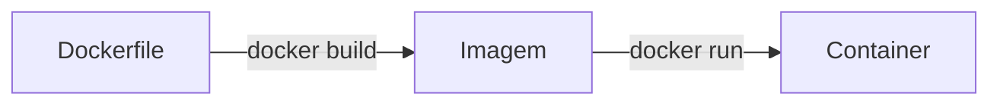

# Imagens, Dockerfile e Build

## Fluxo principal



```text
Dockerfile = receita para criar a imagem
Imagem = ambiente pronto, mas parado
Container = imagem sendo executada
```

## Dockerfile

O `Dockerfile` é um arquivo da aplicação que funciona como receita de criação do ambiente. Ele descreve o que o Docker precisa fazer para montar a imagem.

Ele costuma declarar:

- qual imagem base usar;
- quais dependências instalar;
- quais arquivos copiar;
- qual pasta usar dentro do container;
- qual porta a aplicação usa;
- qual comando iniciar quando o container rodar.

Exemplo para Node.js:

```dockerfile
FROM node:20

WORKDIR /app

COPY package*.json ./

RUN npm install

COPY . .

EXPOSE 3000

CMD ["npm", "run", "dev"]
```

## Instruções mais comuns

| Instrução | Papel |
| --- | --- |
| `FROM` | Define a imagem base |
| `WORKDIR` | Define a pasta principal dentro do container |
| `COPY` | Copia arquivos da máquina para a imagem |
| `RUN` | Executa comandos durante a criação da imagem |
| `EXPOSE` | Documenta a porta usada pelo container |
| `CMD` | Define o comando padrão executado ao iniciar o container |

### `FROM`

Define a imagem base.

```dockerfile
FROM node:20
```

Outros exemplos:

```dockerfile
FROM ubuntu
FROM python:3.12
FROM nginx
FROM postgres
```

### `WORKDIR`

Define a pasta principal dentro do container.

```dockerfile
WORKDIR /app
```

### `COPY`

Copia arquivos da máquina para dentro da imagem.

```dockerfile
COPY . .
```

Também é comum copiar primeiro apenas os arquivos de dependências:

```dockerfile
COPY package*.json ./
```

### `RUN`

Executa comandos durante a criação da imagem.

```dockerfile
RUN npm install
```

Esse comando roda durante o build. Ele não roda toda vez que o container inicia.

### `EXPOSE`

Documenta a porta usada pela aplicação dentro do container.

```dockerfile
EXPOSE 3000
```

`EXPOSE` não publica a porta automaticamente na máquina. Para acessar de fora, é comum mapear a porta:

```bash
docker run -p 3000:3000 minha-api
```

### `CMD`

Define o comando padrão executado quando o container inicia.

```dockerfile
CMD ["npm", "run", "dev"]
```

Se esse processo parar, o container também para.

## Imagens

Uma imagem contém tudo que é necessário para criar um ambiente de execução.

Ela pode conter:

- sistema base;
- dependências;
- bibliotecas;
- arquivos da aplicação;
- configurações;
- comandos padrão;
- variáveis de ambiente;
- informações de porta.

Exemplos de imagens:

```bash
ubuntu
node:20
python:3.12
nginx
postgres
mysql
```

Uma imagem é um ambiente pronto, mas parado. Ela não executa nada sozinha.

## Imagem e container

```text
Imagem = molde/base pronta
Container = molde/base em execução
```

Outra analogia útil:

```text
Imagem = classe
Container = objeto criado a partir da classe
```

A mesma imagem pode gerar vários containers diferentes:

```bash
docker run ubuntu
docker run ubuntu
docker run ubuntu
```

Cada execução cria um container separado.

## Camadas e cache

Imagens Docker normalmente são formadas por camadas. Cada instrução do `Dockerfile` pode gerar uma camada reutilizável.

```dockerfile
FROM node:20
WORKDIR /app
COPY package*.json ./
RUN npm install
COPY . .
```

Essa ordem ajuda o Docker a reaproveitar cache. Se o código mudar, mas o `package.json` não mudar, o Docker pode reutilizar a camada de instalação de dependências.

## Build

`build` é o processo de criar uma imagem a partir de um `Dockerfile`.

```bash
docker build -t minha-api .
```

| Parte | Significado |
| --- | --- |
| `docker build` | Cria a imagem |
| `-t minha-api` | Define nome ou tag da imagem |
| `.` | Usa a pasta atual como contexto de build |

Também é possível versionar a imagem:

```bash
docker build -t minha-api:1.0 .
```

## Contexto de build

O contexto de build é a pasta que o Docker usa como base para criar a imagem.

```bash
docker build -t minha-api .
```

O `.` indica que o contexto é a pasta atual. Arquivos desse contexto podem ser copiados no `Dockerfile`:

```dockerfile
COPY . .
```

Evite deixar arquivos desnecessários no contexto:

- `node_modules`;
- `.git`;
- arquivos temporários;
- logs;
- arquivos grandes;
- arquivos sensíveis.

## `.dockerignore`

O `.dockerignore` funciona parecido com o `.gitignore`. Ele diz quais arquivos o Docker deve ignorar no build.

```dockerignore
node_modules
.git
.env
dist
coverage
```

Isso deixa o build mais leve e reduz o risco de copiar arquivos sensíveis para dentro da imagem.

## Correções importantes

| Ideia errada | Ideia correta |
| --- | --- |
| Dockerfile é uma imagem | Dockerfile é a receita da imagem |
| Container é literalmente a imagem | Container é criado a partir da imagem |
| Container roda dentro da imagem | Container roda a partir da imagem |
| Imagem executa processo | Quem executa processo é o container |

Frase final:

```text
Eu escrevo um Dockerfile para construir uma imagem.
Depois uso essa imagem para criar e rodar containers.
```
