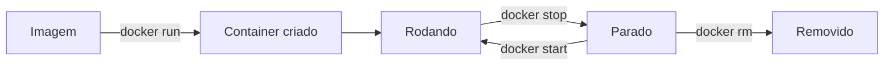

# Containers na Prática

## Ciclo de vida básico



Um container só continua rodando enquanto tiver um processo principal ativo. Se o processo principal termina, o container para.

## `docker run hello-world`

Executa um container usando a imagem oficial `hello-world`.

```bash
docker run hello-world
```

Esse comando testa se o Docker está funcionando. O fluxo é:

1. o Docker Client conversa com o Docker Daemon;
2. o Docker verifica se a imagem existe localmente;
3. se não existir, baixa a imagem do Docker Hub;
4. cria um container;
5. executa o comando da imagem;
6. mostra a mensagem no terminal;
7. finaliza o container.

Saída comum:

```text
Hello from Docker!
This message shows that your installation appears to be working correctly.
```

Esse container não fica rodando para sempre. Ele mostra a mensagem e para sozinho.

## `docker ps`

Lista apenas containers rodando no momento.

```bash
docker ps
```

Colunas comuns:

| Coluna | Significado |
| --- | --- |
| `CONTAINER ID` | Identificador único do container |
| `IMAGE` | Imagem usada para criar o container |
| `COMMAND` | Comando executado ao iniciar |
| `CREATED` | Quando o container foi criado |
| `STATUS` | Estado atual, como `Up`, `Exited` ou `Paused` |
| `PORTS` | Portas usadas ou mapeadas |
| `NAMES` | Nome do container |

## `docker ps -a`

Lista todos os containers, incluindo os parados.

```bash
docker ps -a
```

Diferença importante:

```text
docker ps    = containers rodando
docker ps -a = containers rodando e parados
```

## `docker run ubuntu`

Cria e executa um container baseado na imagem do Ubuntu.

```bash
docker run ubuntu
```

Esse container pode parar rapidamente, porque nenhum processo contínuo foi iniciado.

## `docker run -it ubuntu bash`

Cria um container Ubuntu e entra no terminal dele.

```bash
docker run -it ubuntu bash
```

O `-it` junta duas opções:

| Opção | Função |
| --- | --- |
| `-i` | Mantém a entrada do terminal aberta |
| `-t` | Cria um terminal interativo dentro do container |

Dentro do container, você pode rodar comandos Linux:

```bash
ls
pwd
cat /etc/os-release
apt update
```

Para sair:

```bash
exit
```

Ao sair, o processo `bash` fecha. Como o `bash` era o processo principal, o container também para.

## `run`, `start` e `exec`

| Comando | O que faz |
| --- | --- |
| `docker run` | Cria e executa um container novo |
| `docker start` | Inicia um container que já existe |
| `docker exec` | Executa um comando dentro de um container rodando |

Exemplos:

```bash
docker run -it --name meu-ubuntu ubuntu bash
docker start meu-ubuntu
docker exec -it meu-ubuntu bash
```

Se o container não tiver `bash`, tente `sh`:

```bash
docker exec -it meu-container sh
```

## Parar e remover containers

Para parar um container:

```bash
docker stop meu-ubuntu
```

Para remover um container parado:

```bash
docker rm meu-ubuntu
```

Para forçar remoção de um container:

```bash
docker rm -f meu-ubuntu
```

Correção importante:

```text
docker stop para containers, não imagens.
```

## Imagens baixadas e remoção

Lista imagens baixadas:

```bash
docker images
```

Baixa uma imagem sem executar:

```bash
docker pull ubuntu
```

Remove uma imagem:

```bash
docker rmi ubuntu
```

Você não consegue remover uma imagem se ainda existir um container usando ela. Primeiro remova o container:

```bash
docker rm <CONTAINER_ID>
docker rmi <IMAGE_ID>
```

## Nomeando containers

```bash
docker run --name meu-ubuntu -it ubuntu bash
```

Depois, é possível usar o nome nos comandos:

```bash
docker stop meu-ubuntu
docker start meu-ubuntu
docker rm meu-ubuntu
```

## Rodando em segundo plano

`-d` significa detached, ou seja, o container roda em segundo plano.

```bash
docker run -d --name meu-nginx nginx
```

Para ver se está rodando:

```bash
docker ps
```

## Logs

Mostra logs de um container:

```bash
docker logs meu-nginx
```

Acompanha logs em tempo real:

```bash
docker logs -f meu-nginx
```

## Portas

Containers têm portas internas. Para acessar pela máquina, é necessário mapear.

```bash
docker run -d --name site-nginx -p 8080:80 nginx
```

```text
8080:80
```

| Porta | Significado |
| --- | --- |
| `8080` | Porta da sua máquina |
| `80` | Porta dentro do container |

Acesso no navegador:

```text
http://localhost:8080
```

## Inspeção

Mostra informações detalhadas sobre um container:

```bash
docker inspect meu-nginx
```

Isso ajuda a investigar:

- IP interno;
- portas;
- volumes;
- redes;
- configurações;
- imagem usada;
- status.

## Ordem de prática recomendada

```bash
docker run hello-world
docker ps -a
docker pull ubuntu
docker run -it --name meu-ubuntu ubuntu bash
exit
docker ps -a
docker start meu-ubuntu
docker exec -it meu-ubuntu bash
exit
docker stop meu-ubuntu
docker rm meu-ubuntu
```
