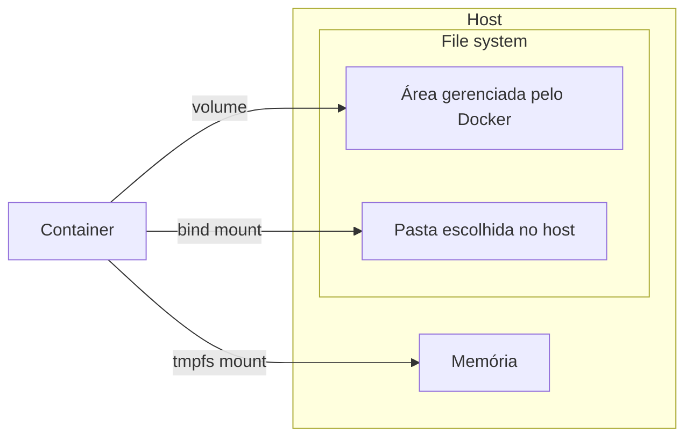

# Persistência, Redes e Compose

## Visão geral da persistência

Por padrão, arquivos criados dentro de um container pertencem ao ciclo de vida daquele container. Se ele for removido, esses dados podem ir junto. Persistência é a forma de ligar o container a algum lugar fora dele para guardar ou compartilhar arquivos.



| Tipo | Onde os dados ficam | Quando usar |
| --- | --- | --- |
| Volume | Área gerenciada pelo Docker | Dados importantes de aplicações e bancos |
| Bind mount | Pasta específica da máquina | Desenvolvimento local e troca rápida de arquivos |
| Tmpfs mount | Memória do host | Dados temporários que não devem ir para disco |

## Volumes

Volumes servem para persistir dados em uma área gerenciada pelo Docker. Por padrão, se você apagar um container, os dados dentro dele podem ser perdidos. Com volume, os dados ficam fora do ciclo de vida do container.

Exemplo com PostgreSQL:

```bash
docker run -d \
  --name meu-postgres \
  -e POSTGRES_PASSWORD=123456 \
  -v postgres_data:/var/lib/postgresql/data \
  postgres
```

| Parte | Significado |
| --- | --- |
| `postgres_data` | Volume gerenciado pelo Docker |
| `/var/lib/postgresql/data` | Caminho onde o PostgreSQL salva dados no container |

Resumo:

```text
Container pode ser removido.
Volume continua existindo.
Dados ficam preservados.
```

### Comandos de volumes

Listar volumes:

```bash
docker volume ls
```

Saída demonstrativa:

```text
DRIVER    VOLUME NAME
local     novo-volume
local     postgres_data
```

| Coluna | Significado |
| --- | --- |
| `DRIVER` | Mecanismo usado para armazenar o volume; no uso local, normalmente aparece como `local` |
| `VOLUME NAME` | Nome do volume gerenciado pelo Docker |

Criar um volume:

```bash
docker volume create novo-volume
```

Criar um container usando volume gerenciado pelo Docker:

```bash
docker run -it --mount type=volume,source=novo-volume,target=/app ubuntu bash
```

| Parte | Significado |
| --- | --- |
| `type=volume` | Indica que o mount será um volume Docker |
| `source=novo-volume` | Nome do volume no Docker |
| `target=/app` | Pasta dentro do container onde o volume aparece |

Em vez de mexer diretamente na pasta interna onde o Docker guarda os volumes, prefira administrar tudo com comandos como `docker volume ls`, `docker volume create` e `docker volume rm`.

## Bind mount

Bind mount liga uma pasta da máquina a uma pasta dentro do container.

```bash
docker run -v $(pwd):/app node:20
```

Isso liga a pasta atual da sua máquina à pasta `/app` dentro do container.

É muito usado em desenvolvimento, porque você altera o código na máquina e o container enxerga essas alterações.

### Comando de bind mount

```bash
docker run -it --mount type=bind,source=/home/ten-menezes/volume-docker,target=/app ubuntu bash
```

| Parte | Significado |
| --- | --- |
| `--mount` | Indica que será criado um ponto de montagem |
| `type=bind` | Liga uma pasta real do host ao container |
| `source=/home/ten-menezes/volume-docker` | Caminho da pasta na máquina hospedeira |
| `target=/app` | Pasta dentro do container onde os arquivos aparecem |

Como o bind mount aponta para uma pasta comum da máquina, qualquer pessoa ou processo com acesso a essa pasta pode alterar ou apagar arquivos. Por isso ele é ótimo para desenvolvimento, mas exige cuidado com dados sensíveis.

| Tipo | Como pensar |
| --- | --- |
| Volume | Gerenciado pelo Docker |
| Bind mount | Pasta específica da sua máquina ligada ao container |

## Tmpfs mount

Tmpfs mount guarda dados apenas na memória do host. Ele é útil para informações temporárias que não precisam continuar existindo depois que o container para.

```bash
docker run -it --mount type=tmpfs,target=/app ubuntu bash
```

Também é possível usar a forma curta:

```bash
docker run -it --tmpfs /app ubuntu bash
```

Esse tipo de mount é mais comum em ambientes Linux. Como os dados ficam em memória, eles desaparecem quando o container é encerrado.

## Variáveis de ambiente

Variáveis de ambiente configuram containers sem deixar tudo fixo no código.

```bash
docker run -e POSTGRES_PASSWORD=123456 postgres
```

Usos comuns:

- senha de banco;
- usuário;
- porta;
- ambiente;
- URL de conexão;
- chaves de API;
- configurações da aplicação.

Em projetos reais, essas informações costumam ficar em arquivos `.env`. Tome cuidado para não copiar `.env` para dentro da imagem e não subir esse arquivo para o Git.

## Redes

Containers podem se comunicar usando redes Docker.

```text
api -> banco postgres
frontend -> api
nginx -> frontend
```

Quando usamos Docker Compose, ele normalmente cria uma rede automaticamente para os serviços do projeto. Assim, uma API pode acessar o banco pelo nome do serviço:

```text
postgres
```

Em vez de depender diretamente de um IP.

## Docker Compose

Docker Compose serve para rodar vários containers juntos usando um arquivo de configuração.

Nomes comuns do arquivo:

```text
docker-compose.yml
compose.yml
```

Fluxo mental:

```text
Dockerfile = cria uma imagem
docker run = roda um container
Docker Compose = organiza vários containers juntos
```

Exemplo:

```yaml
services:
  api:
    build: .
    ports:
      - "3000:3000"

  postgres:
    image: postgres:16
    environment:
      POSTGRES_PASSWORD: 123456
```

Subir os serviços:

```bash
docker compose up
```

Parar e remover os serviços criados pelo Compose:

```bash
docker compose down
```

## Checklist para projetos

| Necessidade | Recurso Docker |
| --- | --- |
| Guardar dados do banco | Volume |
| Refletir código local dentro do container | Bind mount |
| Configurar senha, porta ou ambiente | Variável de ambiente |
| Conectar API, banco e frontend | Network |
| Subir vários serviços juntos | Docker Compose |
