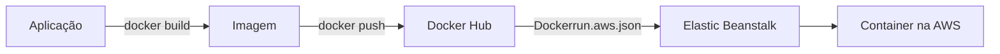
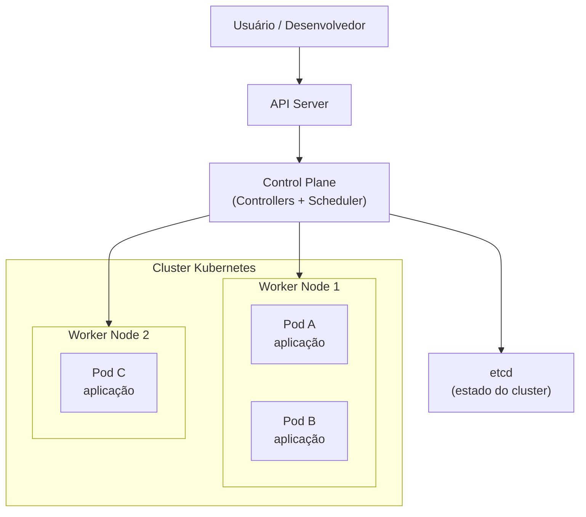

# Infraestrutura Básica e Cloud

Anotações sobre o caminho da aplicação conteinerizada até a nuvem, Docker Compose no projeto All Books e uma introdução ao Kubernetes. Complementa [Persistência, redes e Compose](./05-persistencia-redes-e-compose.md).

## Ideia principal

Infraestrutura é o conjunto de componentes necessários para uma aplicação funcionar. Esses componentes devem garantir:

| Objetivo | Ideia curta |
| --- | --- |
| Acesso | A aplicação pode ser alcançada pelos usuários |
| Segurança | Controles e isolamento reduzem riscos |
| Escalabilidade | Dá para crescer conforme a demanda |
| Eficiência | Usa recursos de forma adequada |

Hoje o fluxo mais comum é conteinerizar a aplicação (web, backend etc.) e subir esse container na nuvem. A cloud facilita também o monitoramento da aplicação.

Serviços em nuvem são fornecidos por **provedores**. Neste estudo, o provedor usado é a **Amazon Web Services (AWS)**.



> Eu construo a imagem, publico no registry e digo ao serviço de cloud qual imagem e porta usar para subir o container.

## Elastic Beanstalk

O serviço usado para subir a aplicação conteinerizada é o **AWS Elastic Beanstalk**.

O Elastic Beanstalk é um serviço da AWS que facilita o deploy e a operação de aplicações na nuvem. Em vez de montar na mão servidores, balanceadores e detalhes de infraestrutura, você envia o código (ou a configuração do container) e a AWS provisiona o ambiente, faz o deploy e ajuda no monitoramento e na escala.

Para o Elastic Beanstalk entender qual imagem buscar no Docker Hub e como subir o container, é preciso criar o arquivo `Dockerrun.aws.json` na raiz do projeto.

### `Dockerrun.aws.json`

Arquivo de referência do projeto: [`curso-react-alurabooks/Dockerrun.aws.json`](./curso-react-alurabooks/Dockerrun.aws.json).

```json
{
    "AWSEBDockerrunVersion": "1",
    "Image": {
        "Name": "tenmenezes/allbooks:1.2",
        "Update": "true"
    },
    "Ports": [
        {
            "ContainerPort": 3000
        }
    ]
}
```

| Campo | O que faz |
| --- | --- |
| `AWSEBDockerrunVersion` | Versão do formato do arquivo lido pelo Elastic Beanstalk |
| `Image.Name` | Imagem no Docker Hub que será baixada e executada |
| `Image.Update` | Indica se o Beanstalk deve atualizar a imagem quando houver nova versão |
| `Ports.ContainerPort` | Porta exposta pela aplicação dentro do container |

### Implantar no Elastic Beanstalk

1. Monte e publique a imagem no Docker Hub (ex.: `tenmenezes/allbooks:1.2`).
2. Crie o `Dockerrun.aws.json` apontando para essa imagem e para a porta correta.
3. No console do Elastic Beanstalk, use **Fazer upload e implantar**.
4. Envie o arquivo `Dockerrun.aws.json` para finalizar a configuração do ambiente de produção.

## Coordenando containers com Docker Compose

Até aqui o ciclo de containers foi feito de forma mais manual. Em um projeto completo como o All Books, a aplicação costuma envolver vários serviços. Nestes casos, usa-se o **Docker Compose**.

O Docker Compose permite definir o ambiente de forma declarativa em um arquivo YAML (`docker-compose.yml`). Nesse arquivo entram imagens, build, portas, variáveis de ambiente e dependências. Assim, a infraestrutura fica descrita como código: o deployment fica mais eficiente, replicável e menos propenso a erros.

Para aprofundar: [Docker Compose para compor uma aplicação](https://www.alura.com.br/artigos/compondo-uma-aplicacao-com-o-docker-compose).

### `docker-compose.yml` do All Books

Arquivo de referência: [`curso-react-alurabooks/docker-compose.yml`](./curso-react-alurabooks/docker-compose.yml).

```yml
version: "3.9"
services:
  server:
    build: .
    container_name: allbooks
    ports:
      - 8080:3000
```

Nesse exemplo, o serviço `server` constrói um container a partir do Dockerfile do diretório atual, nomeia o container como `allbooks` e mapeia a porta `3000` do container para a `8080` do host.

| Componente | O que é | O que faz |
| --- | --- | --- |
| `version: "3.9"` | Versão do formato do Compose | Diz ao Docker qual sintaxe do `docker-compose.yml` interpretar |
| `services` | Lista de serviços da aplicação | Cada serviço vira um (ou mais) containers |
| `server` | Nome lógico do serviço | Identifica o serviço dentro do Compose; pode haver outros (banco, cache etc.) |
| `build: .` | Contexto de build | Usa o `Dockerfile` da pasta atual para construir a imagem |
| `container_name: allbooks` | Nome do container | Define um nome fixo em vez de um nome aleatório |
| `ports` | Mapeamento de portas | Liga portas do host às portas do container |
| `8080:3000` | Regra de porta | `8080` no host → `3000` dentro do container |

Acesso local depois de subir:

```text
http://localhost:8080
```

### Subir o Compose

No terminal, dentro da pasta do projeto:

```bash
docker compose up
```

Isso aplica a configuração do `docker-compose.yml` e sobe os serviços definidos.

Para segundo plano:

```bash
docker compose up -d
```

Para encerrar:

```bash
docker compose down
```

## Entendendo Kubernetes

Kubernetes, em grego, significa timoneiro ou piloto de navio. O nome faz sentido: a ferramenta ajuda a navegar containers em diferentes ambientes. Controlar um conjunto grande de containers sem uma ferramenta adequada pode ser difícil.

Quando é preciso gerenciar vários containers com mais controle, usamos **orquestradores**. O Kubernetes orquestra containers, gerencia um **cluster** com várias máquinas e, pela sua arquitetura, facilita escala, disponibilidade e distribuição da carga.

Para aprofundar: [Kubernetes: conhecendo a orquestração de containers](https://www.alura.com.br/artigos/kubernetes-conhecendo-orquestracao-containers).

### Visão simplificada do Kubernetes



| Peça | Papel curto |
| --- | --- |
| Control Plane | Decide o que deve rodar e em qual nó |
| Worker Node | Máquina que executa os pods |
| Pod | Menor unidade de execução; costuma conter um ou mais containers |
| Cluster | Conjunto de nós gerenciados pelo Kubernetes |

Resumo do caminho neste arquivo:

```text
Dockerfile / Compose → imagem no registry → Elastic Beanstalk na AWS
vários containers → Docker Compose (local / multi-serviço)
muitos containers e máquinas → Kubernetes (orquestração em cluster)
```
