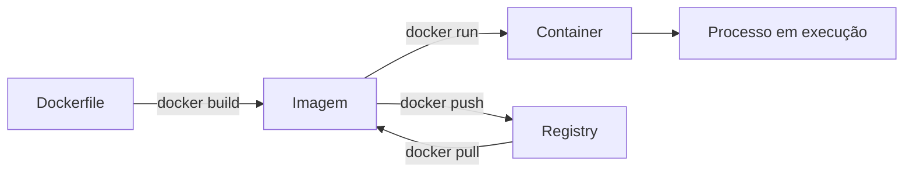

#   Meus estudos em Docker

Anotações reorganizadas do curso de Docker, separadas por assunto para facilitar revisão, consulta rápida e prática no terminal.

## Roteiro de estudo

| Ordem | Arquivo | Foco |
| --- | --- | --- |
| 1 | [Fundamentos de containers](./01-fundamentos-de-containers.md) | O que são containers, diferenças para VMs, namespaces e cgroups |
| 2 | [Arquitetura do Docker](./02-arquitetura-do-docker.md) | Docker Client, Daemon, Engine, host, registries e tags |
| 3 | [Imagens, Dockerfile e build](./03-imagens-dockerfile-e-build.md) | Dockerfile, imagens, camadas, cache, contexto de build e `.dockerignore` |
| 4 | [Containers na prática](./04-containers-na-pratica.md) | `run`, `start`, `stop`, `exec`, logs, portas e ciclo de vida |
| 5 | [Persistência, redes e Compose](./05-persistencia-redes-e-compose.md) | Volumes, bind mounts, networks, variáveis de ambiente e Docker Compose |
| 6 | [Referência de comandos](./06-referencia-de-comandos.md) | Cola de comandos para estudo e revisão rápida |

## Fluxo mental principal



> Eu escrevo um `Dockerfile` para construir uma imagem. Depois uso essa imagem para criar e rodar containers. Se quiser guardar ou compartilhar a imagem, envio para um registry.

## Conceitos que mais aparecem

| Conceito | Ideia curta |
| --- | --- |
| Dockerfile | Receita para criar uma imagem |
| Imagem | Ambiente pronto, mas parado |
| Container | Execução isolada criada a partir de uma imagem |
| Host | Máquina onde o Docker está rodando |
| Docker Client | Comandos digitados no terminal |
| Docker Daemon | Serviço que executa as ações pedidas pelo client |
| Docker Engine | Conjunto principal que faz o Docker funcionar |
| Registry | Local onde imagens ficam armazenadas |
| Volume | Dados persistidos e gerenciados pelo Docker |
| Bind mount | Pasta da máquina ligada a uma pasta do container |
| Network | Comunicação entre containers |
| Docker Compose | Orquestração local de vários containers |

## Imagens usadas nas anotações

As imagens de apoio ficam em [`images-example`](./images-example/):

- [`vm-example.jpg`](./images-example/vm-example.jpg): comparação visual da virtualização com VM.
- [`docker_images_containers_example.png`](./images-example/docker_images_containers_example.png): comparação visual da conteinerização.

## Atalho para praticar

```bash
docker run hello-world
docker ps -a
docker pull ubuntu
docker run -it --name meu-ubuntu ubuntu bash
docker start meu-ubuntu
docker exec -it meu-ubuntu bash
docker stop meu-ubuntu
docker rm meu-ubuntu
```
